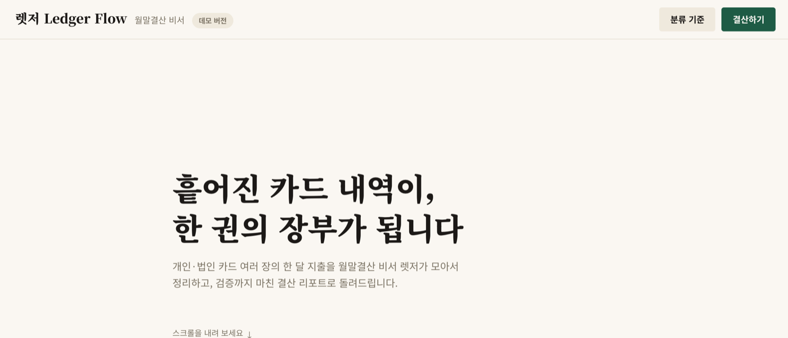
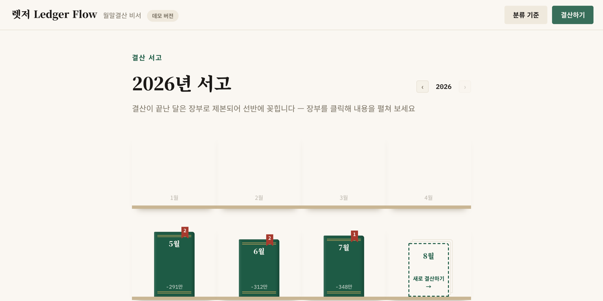
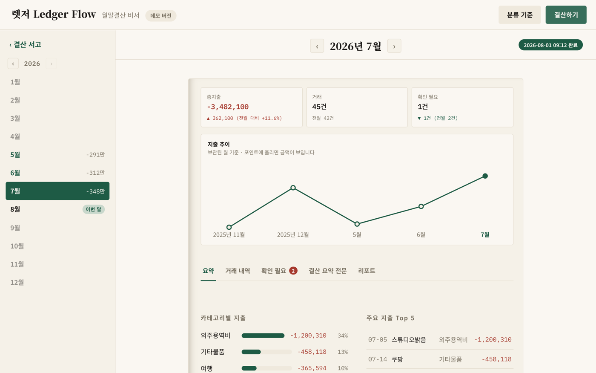
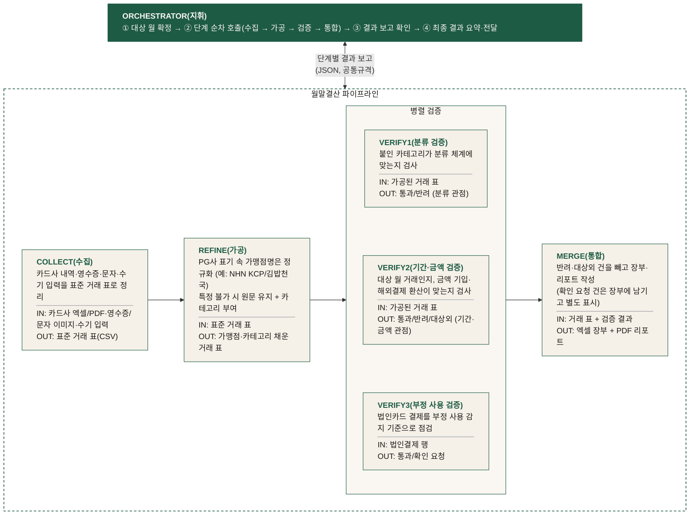

<div align="center">


# 렛저 Ledger Flow
### 월말결산 비서

[](https://team-t6.github.io/ledger-flow/)
[](LICENSE)
[](requirements.txt)
[](https://docs.anthropic.com/)

</div>

카드를 여러 장 쓰다 보면 결제 내역이 카드사 엑셀, 영수증 사진, 결제 문자로 흩어집니다.
월말마다 이걸 한데 모아 장부를 만드는 일은 생각보다 손이 많이 가고, 매달 똑같이 반복됩니다.

ledger-flow는 이 월말결산을 대신해 주는 도구입니다. 카드 내역 파일과 영수증 사진을 넣으면
여러 개의 AI 에이전트가 정리, 분류, 검증을 나눠 맡아 월 결산 장부와 리포트를 만들어 줍니다.
사람은 마지막에 "확인 필요"로 표시된 몇 건만 살펴보면 됩니다.

**데모**: https://team-t6.github.io/ledger-flow/ — 설치 없이 브라우저에서 결산 흐름을 체험해 볼 수 있습니다.



## 무엇이 나오나요

카드사 CSV와 영수증·결제 문자 이미지를 넣으면 두 가지 파일이 나옵니다.

- **엑셀 회계장부** — 전체 거래 내역을 카드(명의)별로 구분하고, 회계 계정과목을 번안한 카테고리로 분류해 정리한 것
- **PDF 결산 리포트** — 한 달 지출을 카테고리별 금액과 비중, 전월 대비 추이로 요약하고, 확인이 필요한 건을 따로 모아 둔 것

결산이 끝난 달은 "장부"가 되어 **결산 서고**에 꽂힙니다. 지난 결산을 다시 볼 땐 이 서고에서 꺼내 보면 됩니다.



장부를 펼치면 그 달의 총지출·거래 건수·확인 필요 건수와 지출 추이, 카테고리별 지출을 한 화면에서 볼 수 있습니다.



## 어떻게 동작하나요

결산 과정을 단계로 나누고, 단계마다 독립된 Claude 에이전트가 일합니다.
오케스트레이터가 순서를 챙기고 단계 사이에서 데이터가 빠지지 않았는지 확인합니다.



- **데이터는 공통 "거래 표" 규격 하나로 흐릅니다.** 수집이 만든 스키마(`transaction_id`·날짜·금액·결제처·카테고리 등)를 가공·검증·통합이 그대로 이어받고, 검증 단계는 그 표에 판정 열(`verify1_result` 등)만 덧붙입니다 — 행을 지우거나 순서를 바꾸지 않습니다.
- **오케스트레이터와 각 단계는 정해진 규격으로만 소통합니다.** 모든 단계는 처리 결과를 `stage`/`status`/`output`/`counts`/`flags`/`message`로 이루어진 동일한 JSON(결과 보고)으로 돌려주고, 오케스트레이터는 산출물 내용을 직접 열어보지 않고 이 보고만 보고 다음 단계 호출·중단을 판단합니다.

설계할 때 정한 원칙이 두 가지 있습니다.

- **돈과 관련된 판단은 렛저가 끝맺지 않습니다.** 검증에서 걸린 거래를 에이전트가 알아서 고치거나, 스스로 다시 시도해 판정을 뒤집지 않습니다. 분류·기간·금액이 걸리면 "확인 필요"로, 부정 사용 소지가 있으면 (단정하지 않고) "확인 요청"으로 표시해 반드시 사람의 확인을 거치게 합니다. 결산 도중에는 중간 확인 화면에서 값을 고치거나, 명의를 알 수 없어 미확정으로 남은 결제구분을 정하거나, 결산에서 뺄 건을 제외할 수 있고, 그대로 둔 건은 리포트의 "확인 필요" 목록에 사유와 함께 실립니다 — 결산이 끝난 뒤에도 결과 화면에서 확정해 재결산할 수 있습니다.
- **검증들은 동시에 돕니다.** 보는 관점(분류 / 기간·금액 / 부정 사용)이 서로 겹치지 않아서 순서를 기다릴 이유가 없고, 사람이 확인해야 할 건도 한 번에 모아서 보여줄 수 있습니다.

## 직접 실행해 보기

Python 3가 있으면 됩니다. 실제 카드 데이터가 없어도 repo에 들어 있는 연습용 가짜 데이터(`sample_data/`)로 돌려 볼 수 있습니다.

### 1. 의존성 설치

macOS / Linux:

```bash
pip install -r requirements.txt
```

Windows:

```bash
py -m pip install -r requirements.txt
```

### 2. `.env` 만들기

repo 루트에 `.env` 파일을 만들고 아래 두 줄을 넣습니다. 이 파일은 `.gitignore`에 등록되어 있어 커밋되지 않습니다.

```
ANTHROPIC_API_KEY=sk-ant-...
INVITE_CODE=원하는초대코드
```

API 키가 없어도 됩니다 — `claude` CLI에 로그인되어 있으면 키 없이 CLI 세션으로 자동 실행됩니다 (그 경우 `.env`에는 `INVITE_CODE`만 두면 됩니다).

### 3. 서버 실행

macOS / Linux:

```bash
python3 orchestrator/server.py
```

Windows:

```bash
py orchestrator\server.py
```

브라우저에서 http://localhost:8788 을 열고, 초대코드를 입력한 뒤 월을 고르고 카드사 CSV와 영수증 이미지를 올리면 결산이 시작됩니다. 진행 상황이 실시간으로 보이고, 끝나면 결과 화면에서 PDF와 엑셀을 내려받을 수 있습니다.

웹 화면 없이 파이프라인만 돌려 보고 싶다면 `python3 orchestrator/run-pipeline.py <대상 월 YYYY-MM>` (Windows: `py orchestrator\run-pipeline.py ...`)을 실행하세요. `sample_data/`의 연습용 데이터로 돌아갑니다.

## 무엇으로 만들었나요

- **Python** — 웹 서버와 파이프라인 실행기 모두 표준 라이브러리로 만들었습니다 (별도 프레임워크 없음)
- **Claude API** (`anthropic`) — 가맹점 식별, 카테고리 분류처럼 판단이 필요한 단계에서 에이전트를 호출합니다
- **openpyxl / reportlab / pypdf** — 엑셀 장부와 PDF 리포트를 만들고, 업로드된 PDF 명세서를 읽습니다 (한글 폰트는 repo에 들어 있습니다)
- 웹 화면은 정적 페이지 하나(`web/index.html`)입니다. 정적으로 열면 데모 연출로, 로컬 서버로 열면 실제 실행 모드로 동작합니다

## 데이터는 안전한가요

- 이 저장소에 있는 데이터는 전부 `sample_data/`의 가짜 데이터입니다. 실제 카드 내역이나 계정 정보는 커밋되지 않도록 막아 두었습니다
- 실행할 때 올린 파일과 로그는 로컬(`uploads/`, `logs/`)에만 남습니다
- 완료된 결산 결과(엑셀·PDF·집계)는 `archive/<월>/`에 로컬로만 보관되며, 결산 서고 화면이 여기서 읽어 옵니다 (실거래 정보이기에 커밋에선 제외)

## 더 알아보기

| 문서 | 내용 |
| --- | --- |
| [PRD](docs/PRD.md) | 문제 정의 · 범위 · 설계 배경 |
| [인터페이스 정의서](docs/interface-spec.md) | 단계 간 계약 · 거래 표 스키마 · 산출물 양식 |
| [카테고리 체계](docs/categories.md) | 회계 계정과목 기반 분류 기준 |
| [디자인 가이드](docs/design-guide.md) | 브랜드 · 화면·산출물 스타일 기준 |
| [온보딩 가이드](docs/onboarding.md) | 프로젝트에 참여하고 싶다면 여기부터 |

team-T6 팀 프로젝트입니다. 라이선스는 [LICENSE](LICENSE)를 참고하세요.
