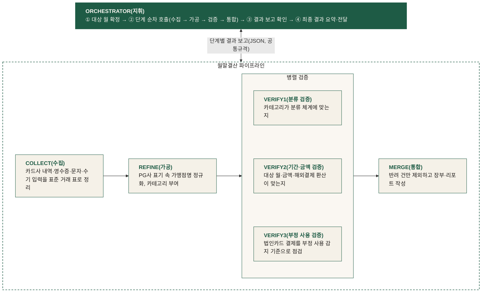

# 렛저 Ledger Flow — 프로젝트 기획안

> 다중 카드 통합 AI 자동 결산 시스템 · 멀티 에이전트 파이프라인 팀 프로젝트 (team-T6)

## 1. 배경 · 문제 정의

개인·법인 명의가 섞인 복수의 카드를 운용하는 순간, 지출 데이터는 카드사별 엑셀·영수증 사진·결제 문자로 파편화됩니다. 월 결산을 하려면 이 이질적인 원천들을 일일이 내려받고, 옮겨 적고, 분류하고, 대조해야 하며 — 이 절차는 매달 같은 순서로 반복되지만 여전히 사람 손으로 돌아가고, 여기에 월 4 - 5시간이 쓰입니다.

문제의 본질은 셋으로 좁혀집니다.

1. **파편화** — 원천마다 형식이 달라 통합 자체가 수작업입니다
2. **반복성** — 동일한 절차가 매달 사람 손으로 재실행됩니다
3. **불투명성** — 결산이 끝나기 전까지는 지출 현황을 아무도 정확히 모릅니다

**렛저 Ledger Flow**는 이 반복 결산을 수집 → 가공 → 검증 → 통합의 멀티 에이전트 파이프라인으로 자동화하고, 사람의 몫은 예외("확인 필요" 건) 처리로 줄이는 월말결산 비서입니다.

## 2. 솔루션 개요

카드사 엑셀과 영수증 사진·결제 문자를 넣으면, 여러 개의 독립된 AI 에이전트가 정리·분류·검증을 나눠 맡아 두 가지 산출물을 만듭니다.

- **엑셀 회계장부** — 전체 거래 내역을 카드(명의)별로 구분하고, 회계 계정과목을 번안한 카테고리로 분류해 정리한 것
- **PDF 결산 리포트** — 한 달 지출을 카테고리별 금액·비중과 전월 대비 추이로 요약하고, 확인이 필요한 건을 따로 모아 둔 것

사람은 마지막에 "확인 필요"로 표시된 몇 건만 살펴보면 됩니다.

### 파이프라인 구조

각 단계는 독립된 에이전트로, 오케스트레이터가 순서를 지휘하고 단계 간에는 정해진 규격(공통 거래 표 스키마, JSON 결과 보고)으로만 데이터를 주고받습니다.

## 3. 차별점

### 3.1 검증은 순서를 기다리지 않고 동시에 돕니다

분류(카테고리 체계 적합성) / 기간·금액(대상 월·부호·해외결제 환산) / 부정 사용(법인카드 감지, 옵트인) — 세 검증은 보는 관점이 서로 겹치지 않습니다. 순서를 기다릴 이유가 없어 같은 가공 결과를 동시에 입력받아 각자 판정하고, 통합 직전에 리포트를 merge합니다. 규칙이 서로 독립이라 순서 의존이 없고, 사람이 확인해야 할 건도 한 번에 모아서 보여줄 수 있습니다.

### 3.2 반려 건은 재시도 루프 없이 사람에게 넘어갑니다

돈과 관련된 판단은 렛저가 끝맺지 않습니다. 검증에서 걸린 거래를 에이전트가 알아서 고치거나, 스스로 다시 시도해 판정을 뒤집지 않습니다. 대신 걸린 건은 "확인 필요"(분류·기간·금액)·"확인 요청"(부정 사용, 단정하지 않음)으로 표시해 반드시 사람의 확인을 거치게 합니다.

- **결산 진행 중**에는 중간 확인 화면에서 바로 고칠 수 있습니다
- **결산이 끝난 뒤**에도 결과 화면·보관된 월의 상세 화면에서 남은 건을 확정해 재결산할 수 있습니다 (통합만 재실행해 장부·리포트를 다시 만들어, 수집 - 검증 재호출 없이 처리)

반려 루프 대신 "빠르게 걸러서 사람에게 한 번에 모아 보여주기"를 택해, 에이전트가 스스로 판단을 뒤집으려다 오히려 오류를 키우는 상황을 막습니다.

## 4. 주요 기능 (구현 완료)

| 기능 | 내용 |
| --- | --- |
| 파일 업로드 | 카드사 엑셀·CSV·PDF 명세서, 영수증·결제 문자 이미지, zip 압축 일괄 업로드 |
| Google Drive 연동 | 지정 폴더의 파일을 가져와 업로드와 동일 경로로 처리 |
| 진행 현황 | 결산 진행률 실시간 표시, 단계별 처리 건수 |
| 중간 확인 | 결산 도중 "확인 필요" 건을 화면에서 바로 수정·확정 |
| 결산 서고 | 완료된 월을 장부처럼 보관·열람, 전월 대비 비교·추이 |
| 재결산 | 결산 완료 후에도 남은 확인 필요 건을 확정해 산출물 재생성 |
| 분류 기준 설정 | 카테고리 체계를 화면(GNB "분류 기준" 메뉴)에서 직접 편집 |
| 부정 사용 감지 (옵트인) | 토글을 켜면 법인카드 결제를 감지 기준으로 함께 점검 |

## 5. 산출물

- **엑셀 회계장부**: 정제·분류 완료된 전체 거래 내역 — 카드(명의)별 구분, 카테고리 부여 상태
- **PDF 결산 리포트**: 결산 개요 → 월별 비교·추이 → 종합 분석·인사이트 → 법인결제 분석 → 개인결제 분석 → 해외결제 명세 → 확인 필요 항목 순으로 구성된 7개 섹션 리포트

## 6. 추진 현황

- **기간**: 2026-08-05(최초 커밋) - 2026-08-31(현재까지) — 총 191개 커밋
- **파이프라인**: 수집·가공·검증(분류/기간·금액/부정 사용)·통합·지휘 7개 단계 전부 실제 Claude 에이전트 연동 완료
- **웹**: 초대코드 인증, 업로드, 진행 현황, 중간 확인, 결산 서고, 재결산, 분류 기준 설정까지 실제 실행 모드로 동작
- **데모**: GitHub Pages에 상시 공개 — 브라우저에서 결산 흐름을 바로 체험 가능

## 7. 시연 계획

- **GitHub Pages 데모** — 설치 없이 브라우저에서 결산 흐름을 둘러보는 쇼케이스 (`demo` 브랜치의 `web/` 변경 시 자동 배포)
- **로컬 실제 실행 시연** — 로컬 서버 + Cloudflare quick tunnel로 실제 파이프라인 실행(파일 업로드 → 에이전트 결산 → 산출물 다운로드)을 그 자리에서 보여주는 시연

## 8. 향후 확장

- **챗봇**: 결산 데이터 기반 질의응답 — 특정 결제 찾기("이 결제 언제 했지?"), 집계 질문("편의점에서 얼마 썼지?"), 누락 데이터 확인. 아직 착수 전이며 시간 여유에 따라 진행

## 9. 기술 스택

- **Python 3** — 웹 서버는 표준 라이브러리 `http.server`(프레임워크 없음)
- **Claude API** (`anthropic` SDK) — 가맹점 식별·카테고리 분류 등 판단이 필요한 단계에서 에이전트 호출 (API 키 없으면 `claude` CLI 로그인 세션으로 폴백)
- **openpyxl · reportlab · pypdf** — 엑셀 장부·PDF 리포트 생성, 업로드 PDF 명세서 텍스트 추출
- 웹 화면은 정적 페이지 하나(`web/index.html`) — 정적으로 열면 데모 연출, 로컬 서버로 열면 실제 실행 모드로 자동 전환
